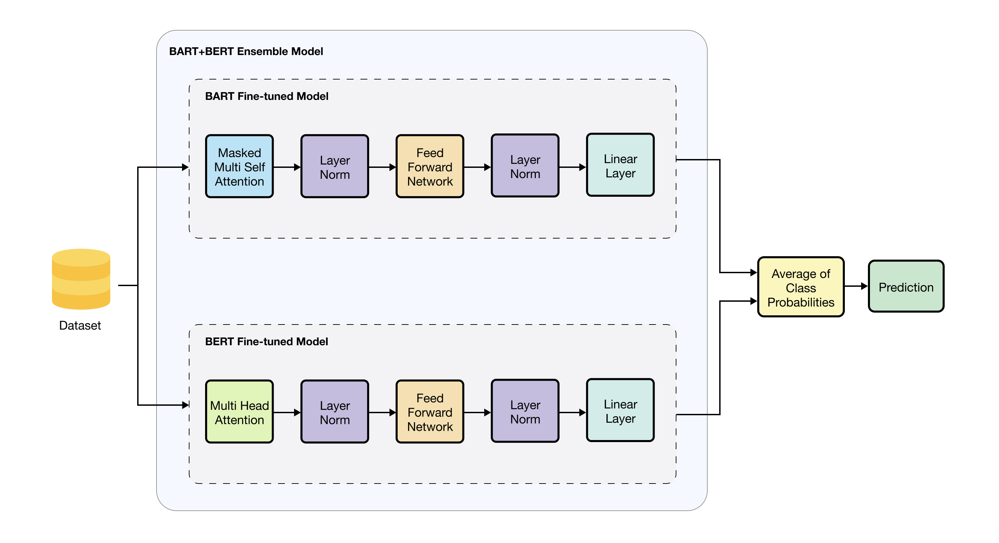

# BART+BERT Ensemble ABSA Model for Indonesia Tourism Attraction Review

## Overview

This repository contains the code and resources for  final research project that combines BART and BERT models using the ensemble method. The main goal is to improve Aspect-based Sentiment Analysis (ABSA) model performance for the [Indonesia’s Tourism Destinations dataset](https://github.com/dian9395/dataset-gold-aspectbased-borobudur-prambanan) (Study case: Borobudur and Prambanan temples). 

## Proposed Model Description



### BART+BERT Ensemble Model
1. **Model Components**: We utilize a pretrained model BART<sub>LARGE</sub> model for BART and a BERT<sub>BASE</sub> Uncased model for BERT. These models are fine-tuned on the dataset for enhanced the performance.
2. **Ensemble Library**: The [ensemble transformers](https://github.com/jaketae/ensemble-transformers) library is employed to seamlessly combine the two models.
3. **Dataset**: The dataset used for fine-tuning can be found at [this GitHub repository](https://github.com/dian9395/dataset-gold-aspectbased-borobudur-prambanan).

### Fine-Tuning and Customization
1. **Fine-Tuning**:
    - **BART**: Fine-tuned using the the dataset
    - **BERT**: Similarly, fine-tuned on the dataset
2. **Layer Modification**:
    - For each model (BART and BERT), the final layer (usually known as **head**) is modified by adding a **linear layer**.
    - The ensemble model predicts by averaging the class probabilities from both models.

### Model Interface
Take a peek at what the Streamlit app interface looks like:


### Demo
Check out the video demo of the model below:

[](https://youtu.be/uVUZ8us22SM)

## Model and Resources

- **BART**: [Download BART<sub>LARGE</sub> model](https://huggingface.co/facebook/bart-large)
- **BERT**: [Download BERT<sub>BASE</sub> Uncased model](https://huggingface.co/google-bert/bert-base-uncased)
- **Dataset**: [Gold Aspect-Based Dataset for Borobudur and Prambanan](https://github.com/dian9395/dataset-gold-aspectbased-borobudur-prambanan)

<br> <br>

```
🧞‍♂️ TASI-2324-118

1. 12S20024 - Sandro Sinaga
2. 12S20042 - Mastawila F. Simanjuntak
3. 12S20048 - Jevania

Supervisor I :  Samuel I. G. Situmeang, S.TI., M.Sc.
Supervisor II:  Sarah R. Tambunan, S.Kom, M.Sc.
```

---

*© Information System Study Program, Faculty of Informatics and Electrical Engineering, Institut Teknologi Del, 2024*

---
